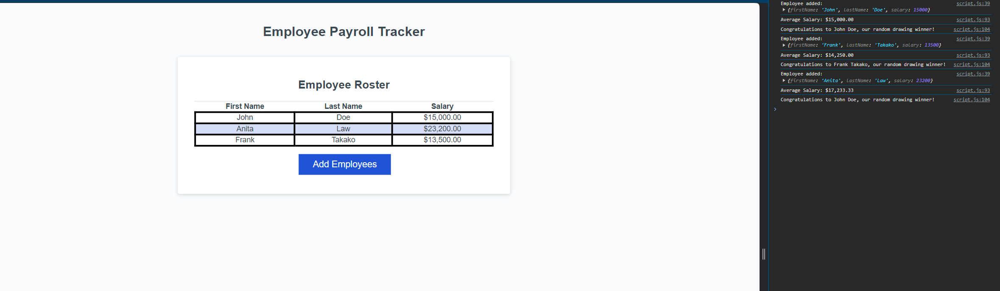

# Employee Payroll Tracker 

## Table of Contents
* [What this project is](#what_this_project_is)
* [What was done](#What_was_done)
* [How it looks like](#how_it_looks_like)

## What_this_project_is

The project is a starting code for employee payroll tracker. Code was missing the java scripts code, what has direct impact on not working button on the web site. The client asked for employee payroll tracker to be able to see his employees payroll data and properly budget for the company.

## What_was_done

The project was added java script. JS make button react for the click and receive information/data by windows prompt about employee first name, last name and salary. The data is sort by last name and showed on web site in the table format. In the console JS also showing us randomle chosen employee with congratulations and average employee salary. For the salary was also added proper currency format.

## How_it_looks_like

